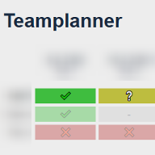

<p align="center">
  </img>
  <div style="font-weight: bold; text-align: center">Quickly get an overview of you team's schedule and lineup!</div>
</p>
<hr>

## Overview

Teamplanner stores your teams lineup and matches and provides an easy method to record your teammates' availability for each match.

It consists of a RESTful API written in Go and backed by [buntdb](https://github.com/tidwall/buntdb). It can be used with the included [PWA](/teamplanner-spa).

## Quickstart

Build the container with
```
docker build -t teamplanner .
```
and run it:
```
docker run -dp 8042:8042 --name teamplanner teamplanner
```

## Configuration

### Networking
The app listens on `:8042` by default and port 8042 is exposed from the container. You can override it by setting the `LISTENADDR` environment variable. 
You should use a reverse proxy to handle HTTP termination if you want to expose it to the internet.

### Persistence
The database is by default stored at `/data/teamplanner.db`. Mount `/data` to a volume or use a bind mount to persist it over container restarts.

You can also change the location of the database by setting the environment variable `DBPATH` to the absolute path of the file.

Technically it's also possible to store the database completely in memory by setting `DBPATH` to `:memory:`.

## Endpoints

### `GET /teammates`
Returns all teammates as JSON array.

### `GET /teammate/{id:[0-9]+}`
Returns the given teammate.

### `GET /teammate/{id:[0-9]+}/votes`
Returns all votes by the given teammate as array

### `POST /teammate`
Sets (i.e. creates or updates) a teammate. The request body MUST contain the data as JSON object.

### `GET /matches`
Returns all matches as JSON array.

### `GET /match/{id:[0-9]{8}}`
Returns the given match.

### `GET /match/{id:[0-9]+}/votes`
Returns all votes for the given match as array

### `POST /match`
Sets (i.e. creates or updates) a match. The request body MUST contain the data as JSON object.

### `GET /votes`
Returns all votes as array

### `POST /vote`
Creates or updates a vote. The request body MUST contain the data as JSON object

## Schema

### Teammate

```
{
    "type": "object",
    "properties": {
        "name": { "type": "string" },
        "position": { "type": "number" },
        "status": { "type": "number" }
    },
    "required: ["name", "position", "status" ]
}
```
Position is used as the identifier for the entity.
`status` has the possible values `0-2` for "Available", "Unavailable" and "Spare".

### Match
```
{
    "type": "object",
    "properties": {
        "date": { "type": "date" },
        "description": { "type": "string" }
    },
    "required: ["date", "description" ]
}
```
The date in the format `YYYYMMDD` is used as the identifier for the entity.

### Vote
```
{
    "type": "object",
    "properties": {
        "teammate": { "type": "string" },
        "match": { "type": "string" },
        "vote": { "type": "number" }
    },
    "required: ["teammate", "match", "vote" ]
}
```
`teammate` and `match` are references to the respective entities by their identifier.
`vote` has the possible values `0-2` for Yes, No, Maybe.

## Limitations

Currently there is no authentication or authorization whatsoever supported by the API. Use at your own risk, if you want to.